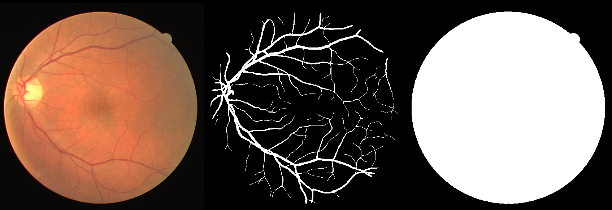

# retinal_vessel_segmentation

# Data

# TODO
* stable diffusion for data augmentation
* Dice loss (for metrics), IoU (Jaccard index)
* U-net squarred
* Focal loss? ask colleagues for tricks in segmentation
* hydra
* interpretebility (gradcam, saliency maps ,captum)
* distributed training
* Mask2Former
* use torch.timm other backbones
* hyperopt

* add something from statistics (confidence tests etc.)

* multi-layer loss

pip install hydra-core

* DiceLoss + FocalLoss https://gitlab.giraffe360-mimosa.com/machine-learning/training/mirror-segmentation-trainer/-/blob/main/scripts/model.py?ref_type=heads

You are using a CUDA device ('NVIDIA RTX A4000') that has Tensor Cores. To properly utilize them, you should set `torch.set_float32_matmul_precision('medium' | 'high')` which will trade-off precision for performance. For more details, read https://pytorch.org/docs/stable/generated/torch.set_float32_matmul_precision.html#torch.set_float32_matmul_precision