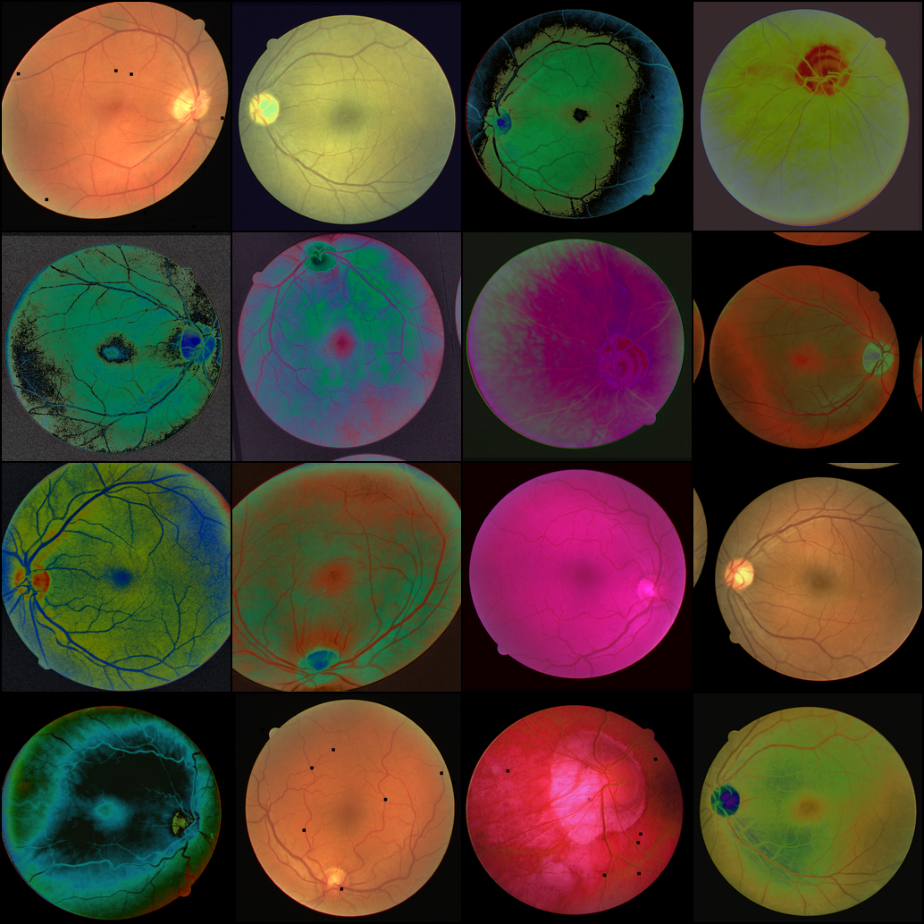
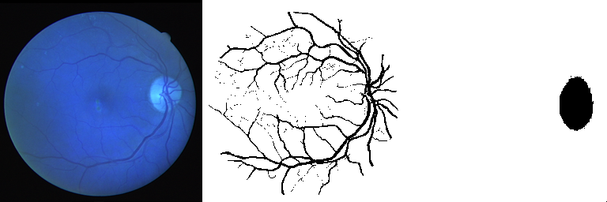
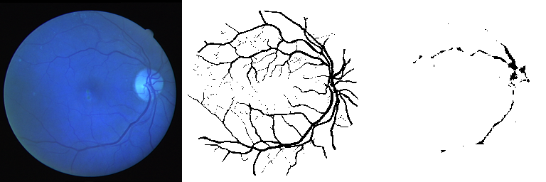
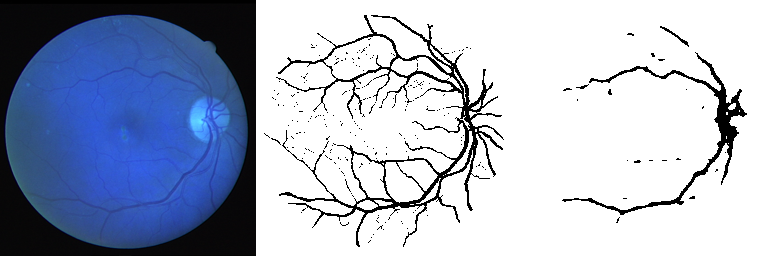
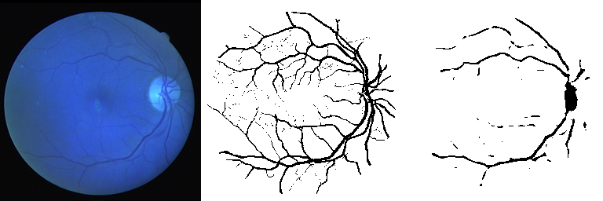
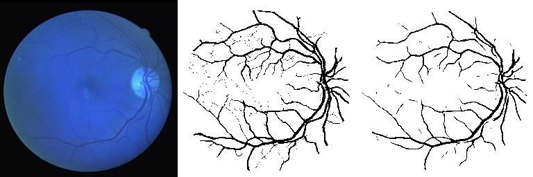
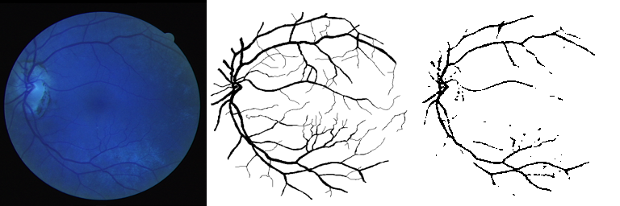

# retinal_vessel_segmentation

# Data


# Augmentation


# Training (fucked color channel)





# Test example




# Installation
```bash
$ pip install -r requirements.txt
$ python prepare_dataset.py
$ python main.py
```
TODO: about all scripts

# Features
* Monitoring with W&B
* HPO
* Running of multiple configs with hydra
...TODO


# TODO
* suppersampling or upsampling back resolution (GuidedConvFilter add to the architecture)
* stable diffusion for data augmentation (ControlNet) 
* U-net squarred
* hydra
* interpretebility (gradcam, saliency maps ,captum)
* distributed training
* MaskFormer, FocalNet
* use torch.timm or smp backbones
* hyperopt (hpo)
* multi-layer loss
* DiceLoss + FocalLoss https://gitlab.giraffe360-mimosa.com/machine-learning/training/mirror-segmentation-trainer/-/blob/main/scripts/model.py?ref_type=heads
* Tversky loss (check smp libraries loss and metrics)
* add reqs (mamba, miniconda, devcontainer)
* add confusion matrix to wandb
* add modelcheckpoint for saving weights
* self-supervised learning (since masks are not perfect)
* advanced train set augmentation (ideas :get new images with diffusion -> segment -> retrain and compare, maybe filter out bad masks visually or which are out of distribution)
* try to inference with this model bigger dataset on Kaggle and compare
* numba and torch.jit
* model pruning and distillation
* openvino inference


# Fix
* show augmented training image masks
* wandb don't delete local runs which were removed on website
* wandb multiple colors on segmentation
* wandb image plot steps don't match epoch
* inverse mask
* inference not working (+ test trainer.test)


pip install hydra-core

You are using a CUDA device ('NVIDIA RTX A4000') that has Tensor Cores. To properly utilize them, you should set `torch.set_float32_matmul_precision('medium' | 'high')` which will trade-off precision for performance. For more details, read https://pytorch.org/docs/stable/generated/torch.set_float32_matmul_precision.html#torch.set_float32_matmul_precision